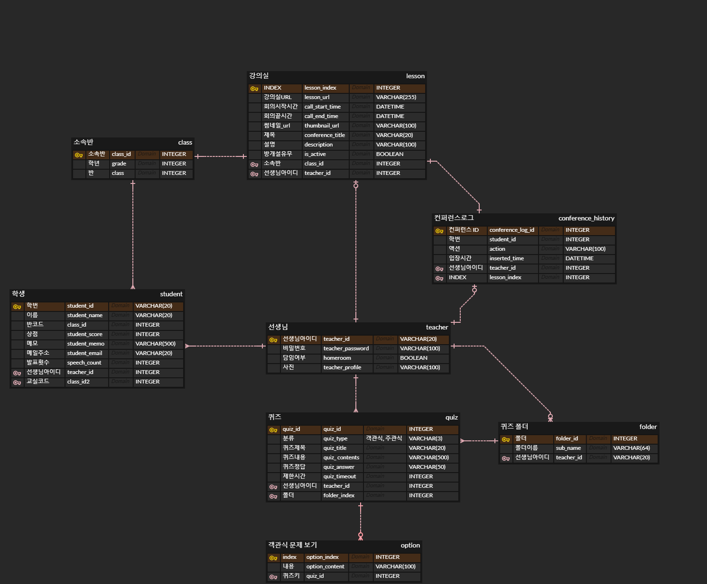

# 웹/모바일(웹 기술) 스켈레톤 프로젝트

<!-- 필수 항목 -->

## 카테고리

| Application | Domain | Language | Framework |
| ---- | ---- | ---- | ---- |
| :white_check_mark: Desktop Web | :black_square_button: AI | :white_check_mark: JavaScript | :black_square_button: Vue.js         |
| :white_check_mark: Mobile Web | :black_square_button: Big Data | :black_square_button: TypeScript | :white_check_mark: React |
| :white_check_mark: Responsive Web | :black_square_button: Blockchain | :black_square_button: C/C++ | :black_square_button: Angular |
| :black_square_button: Android App | :black_square_button: IoT | :black_square_button: C# | :black_square_button: Node.js |
| :black_square_button: iOS App | :black_square_button: AR/VR/Metaverse | :white_check_mark: Python | :white_check_mark: Flask/Django |
| :black_square_button: Desktop App | :black_square_button: Game | :white_check_mark: Java | :white_check_mark: Spring/Springboot |
| | | :black_square_button: Kotlin | |

<!-- 필수 항목 -->

## 프로젝트 소개

* 프로젝트명: 그룹 비디오 컨퍼런스 서비스 - 가제 티칭마스터
* 서비스 특징: 초등학교 수업을 위한 웹RTC서비스
* 주요 기능
  - 로그인
  2. 화면공유(교사)
  3. 마이크, 캠 강제 off / on 제안
  - 퀴즈
  - 하이라이팅
  - 발표(스테이지로 이동)
  6. 상점
  7. 메모장
  8. 세부세션
  	교사: 들어가지 않아도 음성on/off 가능, 조별묶음으로 보이도록
  	학생: 조원 + 교사 보이도록
  9. 실시간 채팅
* 주요 기술
  - WebRTC
  - WebSocket
  - JWT Authentication
  - REST API
* 참조 리소스
  * Vuetify: 디자인 전반 적용
  * Vue Argon Design System: 디자인 전반 적용
  * Vue Black Dashboard Pro(유료): 캘린더 컴포넌트 사용
  * AR Core: 구글에서 제공하는 AR 지원 라이브러리. 이미지 인식 및 오버레이 영상에 활용
  * Color Thief: 이미지 색상 추출 라이브러리. 커버 사진 색상 추출 및 배경 변경에 활용
  * Animation.css: CSS 애니메이션 지원 라이브러리. 메인 페이지 진입 애니메이션에 활용
* 배포 환경
  - URL: // 웹 서비스, 랜딩 페이지, 프로젝트 소개 등의 배포 URL 기입
  - 테스트 계정: // 로그인이 필요한 경우, 사용 가능한 테스트 계정(ID/PW) 기입

<!-- 자유 양식 -->

## 팀 소개
* 이혜진: 팀장, 프론트엔드 개발
* 김현태: 백엔드 개발
* 박성은: 부팀장, 백엔드 개발
* 임현홍: 프론트엔드 개발
* 조영현: 프론트엔드 개발
* 진은정: 백엔드 개발

<!-- 자유 양식 -->

## 프로젝트 상세 설명

// 개발 환경, 기술 스택, 시스템 구성도, ERD, 기능 상세 설명 등

- 🥇로그인

  - 교사: 모든 반에 접근 가능
  - 학생: 등록된 반으로 이동(or 해당 학년만 보이게)

- 🥈음소거

  - 교사: 전체 음소거(학생), 본인
  - 학생: 본인 음소거

- 🥈캠 on/off

  - 교사: 전체 off(학생), 본인 on/off
  - 학생: 본인 on/off

- 화면공유 on/off

  - 🥇교사
  - 🥈학생

- 🥇실시간 채팅

- 칭찬기능

  - 🥇상점(화면에 스티커는 선택기능)
  - 🥉박수(+소리)

- 🥈세부세션: 조별활동, 쉬는시간

- 🥇퀴즈: 퀴즈내기(교사), 문제 풀기(학생)

- 🥇참여도에 따른 학생 하이라이팅 (발표 수 기준, 일주일)

- 🥈랜덤 뽑기: 참여도에 따른 가중치조 발표자 선정, 조 나누기(몇명, 몇조)

- 🥇학생 정보기록(메모장): ex) 이번주 금요일 백신3차

- 🥈알림장

  - 공지 팝업 - 5분 뒤 수업 시작
  - 숙제, 준비물

- 🥉과제제출

- 🥉가상배경

- 🥉화면녹화

- 🥈배경 색 바꾸기(하늘색 배경 부분)

## commit 규칙

220111 || what_how

## ERD

### 스토리보드

---

[스토리보드링크](https://www.figma.com/file/COFtDlmHGiKRHsNe8TZvWh/%E3%85%85%E3%85%8C%E3%84%B9?node-id=0%3A1)

### 와이어 프레임

---

