# 웹 프로젝트 : 티칭마스터

# 1. 서비스 소개 


## 카테고리

| Application | Domain | Language | Framework |
| ---- | ---- | ---- | ---- |
| :white_check_mark: Desktop Web | :black_square_button: AI | :white_check_mark: JavaScript | :black_square_button: Vue.js         |
| :white_check_mark: Mobile Web | :black_square_button: Big Data | :black_square_button: TypeScript | :white_check_mark: React |
| :white_check_mark: Responsive Web | :black_square_button: Blockchain | :black_square_button: C/C++ | :black_square_button: Angular |
| :black_square_button: Android App | :black_square_button: IoT | :black_square_button: C# | :black_square_button: Node.js |
| :black_square_button: iOS App | :black_square_button: AR/VR/Metaverse | :black_square_button: Python     | :black_square_button: Flask/Django |
| :black_square_button: Desktop App | :black_square_button: Game | :white_check_mark: Java | :white_check_mark: Spring/Springboot |
| | | :black_square_button: Kotlin | |


## 1. 서비스 설명

### 개요

- 한 줄 소개 : 비대면 수업으로 힘들어하는 선생님과 학생들에게 더 나은 교육환경을 제공하는 플랫폼
- 서비스 명 : 티칭마스터(Teaching Master)

### 타겟

- 초등학생👧
  - 기존의 화상수업 UI를 어려워 하는 학생들에게 적합
- 초등학생 선생님👩‍🏫
  - 수업자료 준비 시간을 줄이고 싶은 선생님
  - 비대면 수업으로 인한 학생 관리에 정신 없는 선생님

## 2. 기획 배경

### 배경

- 대체적으로 정적인 수업인 온라인 수업이 진행되고 그로 인해 학생들의 집중력 저하가 크다고 합니다 . 또한 선생님들은 학생들의 화면밖에 보지 못하기 때문에 학생들의 이해정도와 학습 상황을 파악하기가 어렵다고 합니다 .
- 양쪽 측면에서 이러한 비대면 수업의 불편함을 개선하고 더 나은 경험을 제공하기 위해 크게 세가지 기능을 구현했습니다.
  - 선생님들끼리 공유 가능한 `퀴즈` 기능
  - 학생의 수업집중도를 파악할 수 있게 만든 `별점` 기능
  - 그리고 이 수업집중도를 가시적으로 확인할 수 있는 `하이라이팅` 기술
- 이렇게 학생들의 수업 집중도를 파악할 수 있게 되면 참여가 낮은 학생에게도 발표의 기회를 줄 수 있고 , 퀴즈를 통해 학생들의 이해정도를 파악할 수 있게 되어 선생님 입장에서도 질 높은 강의를 할 수 있고 학생들도 더 재밌게 참여할 수 있게 됩니다. 이처럼  선생님과 학생들이 서로 상호작용하여 서로 행복하고 즐거운 수업을 만드는데 도움이 되었으면 좋겠다는 마음으로 이 프로젝트를 제작하게 되었습니다.

### 목적

- 화상수업 UI가 어려운 학생들이 쉽게 사용할 수 있게 하자
- 비대면 수업으로 학생관리가 힘든 선생님의 수업을 조금 더 편하게 하자

### 의의

- 비대면 수업에서 학생들과 선생님들이 쉽게 사용할 수 있는 플랫폼
- 퀴즈 및 하이라이팅으로 학생 수업 참여도를 확인하고, 균등한 수업 참여 제공

## 3. 서비스 화면

### 메인페이지

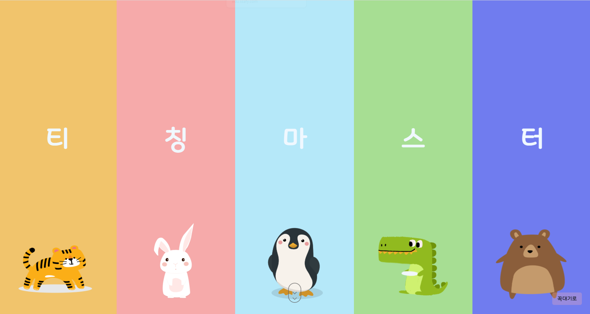

## 4. 발표 영상 or ucc

[싸피(SSAFY) 6기 공동프로젝트 UCC(티칭마스터 )](https://youtu.be/k_EJWArFbyw)


# 2. 기술 스택

---

## 1. WebRTC


```
WebRTC란, Web Real-Time Communication의 준말로, 
웹에서 실시간 소통을 가능하게 해주는 기술입니다.

WebRTC로 구성된 프로그램들은 별도의 플러그인이나 소프트웨어 없이 
음성, 영상 혹은 텍스트, 파일과 같은 데이터들을 브라우저끼리 주고받을 수 있습니다.
```


```
OpenVidu is a platform to facilitate the addition of video calls 
in your web or mobile application. 
It provides a complete stack of technologies very easy to integrate in your application. 
Our main goal is to allow developers to add real-time communications 
to their apps very fast and with low impact in their code.
// 출처 : https://docs.openvidu.io/en/stable/ [openVidu 공식 문서] 
```

> OpenVidu is a platform to facilitate the addition of video calls
in your web or mobile application.
It provides a complete stack of technologies very easy to integrate in your application.
Our main goal is to allow developers to add real-time communications
to their apps very fast and with low impact in their code.

출처 : https://docs.openvidu.io/en/stable/ [openVidu 공식 문서]


우리는 WebRTC기능을 제공하기위해 openVidu를 사용했습니다.

openVidu는 다양한 프레임 워크와 호환성이 좋으며, 간편하게 여러 기능들을 적용시킬 수 있습니다.

openVidu에 대해 자세히 알아보고 싶다면 [[https://docs.openvidu.io/en/stable/](https://docs.openvidu.io/en/stable/)] 를 참고하십시오.

## 2. Web Socket

Web Socket ?

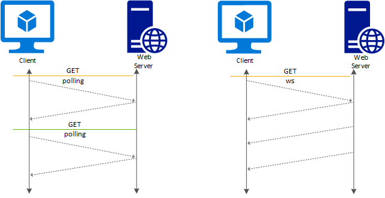

```
기존의 서버와 클라이언트간의 통신방법인 HTTP 는
Request-Response 기반의 Stateless protocol 입니다.
클라이언트가 서버에 요청을 보내면, 서버가 클라이언트에게 응답을 해주는 방식입니다.
따라서 클라이언트가 서버에 요청하지 않으면 클라이언트는 서버의 변경사항을 확인할 수 없습니다.

하지만 WebRTC 에서는 클라이언트 간의 빠른 데이터 교환을 통한 실시간 소통이 아주 중요하기 때문에
HTTP 방식이 아닌 Web Socket 방식을 사용합니다.

Web Socket은 Stateful protocol이기 때문에 클라이언트가 서버와 한 번 연결이 되면
계속 같은 라인을 통해 통신하기 때문에 서버에 변경사항이 생길 때마다 클라이언트에게 제공하므로
HTTP와 TCP연결간에 필요없이 발생하는 트래픽을 피하면서 실시간 데이터 교환이 가능합니다.

```

## 3. React.js


저희는 SPA를 제작하기 위해 SPA 대표 프레임워크 중 `React`를 이용하였습니다.

### SPA?

Single Page Application 의 약자로, 단일 페이지로 구성된 웹 애플리케이션을 말합니다.

렌더링의 역할을 서버에 넘기지 않고 브라우저에서 처리하는 방식입니다.

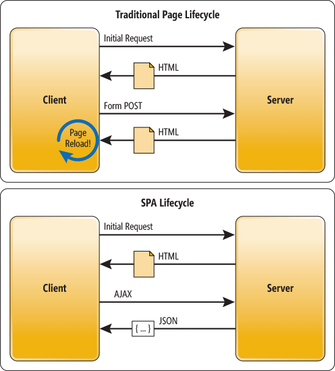

- 장점
  - 모듈화 또는 컴포넌트별 개발이 용이합니다.
  - 부분만 갱신하기 때문에 전체적인 트래픽이 감소합니다.
  - 새롭게 갱신되는 부분만 렌더링하기 때문에 새로고침이 발생하지 않아 화면 깜빡임이 없는 자연스러운 사용자 경험을 제공합니다.
- 프레임워크
  - Angular
  - React
  - Vue

### 리액트?


리액트는 사실 프레임 워크가 아닌 라이브러리입니다. 하지만 컴포넌트를 사용하기 위해서는 프레임워크처럼 규칙을 지켜야 합니다.

- 리액트의 장점
  - React Native 를 이용해 앱 개발까지 이어질 수 있는 메리트가 있습니다.
  - 개발자들이 가장 많이 쓰이는 웹 프레임워크입니다.
    - 거대한 커뮤니티를 가지고 있어 여러 확장 라이브러리를 사용할 수 있다는 장점이 있습니다.
  - 컴포넌트의 가독성이 매우 높고 간단하여 유지보수와 UI수정이 쉽고 재사용이 용이합니다.
  - 프레임워크가 아닌 라이브러리이기 때문에 다른 프레임워크와 혼용이 가능합니다.
- 컴포넌트 단위 작성으로 생산성과 유지 보수를 용이하게 할 수 있습니다. 또한 컴포넌트의 재사용이 쉽기 때문에 여러 곳에서 가져다 사용할 수 있습니다.

## 4. Spring Boot


### SpringFramework?

Java의 웹 프레임워크로 Java언어 기반으로 다양한 어플리케이션을 만들기 위한 툴

JSP 서블릿과 데이터베이스 커넥션을 연결해주는 Mybatis, JPA 등의 기술을 더 편하게 사용가능

- 특징
  - **IoC (Inversion of Control, 제어반전)**
    - 인스턴스의 생성부터 소멸까지의 생명주기 관리를 Spring이 관리
  - **DI (dependency injection, 제어반전)**
    - 프로그래밍에서 구성요소 간의 의존관계가 소스코드 내부가 아닌 외부의 설정파일을 통해 정의
  - **AOP (Aspect Object Programming, 관점 지향 프로그래밍)**
    - 보안 등 공통적으로 사용하는 기능을 분리하고 관리

### Spring Boot란?

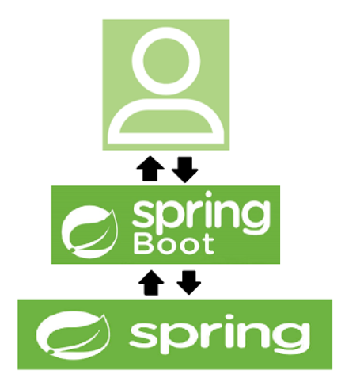

SpringBoot는 SpringFramework 기반의 프로젝트를 복잡한 설정없이 쉽고 빠르게 만들어주는 라이브러리

### 장점

- **라이브러리 관리의 자동화**
- **라이브러리 버전 자동관리**
- **SpringFramework 설정 자동**
- **내장 Tomcat 사용 가능**
- **독립 실행 가능한 JAR 배포**

## 5. JPA & Hibernate


### JPA란?

- Java Persistence API로 Java에서 ORM을 사용하기 위한 Interface를 모아둔 것

### Hibernate

- JPA Interface를 상속 받은 구현체

### 사용 이유

- DB중심 설계가 아닌 객체 중심 설계로 생산성이 좋고 유지보수성이 좋음
- MySQL, Oracle등 DBMS에 대한 종속성이 줄어듦
<!-- 자유 양식 -->

# 3. 컨텐츠 소개

---

## 선생님 제공 기술

**1. 교실 열기/닫기**

- 선생님은 교실을 열거나 닫을 수 있으며, 교실을 열고 나면 교실에 입장할 수 있습니다.

  


**2. 퀴즈 관리 및 공유**

- 원하는 퀴즈를 전체보기/과목별, 학년별로 찾아서 저장 할 수 있습니다.

  

- 원하는 퀴즈가 없다면 직접 제작도 가능합니다.

  

**3. 퀴즈 출제**

- 선생님은 즐겨찾기 했던 퀴즈들을 수업중에 학생들에게 제출할 수 있습니다.

  

  

**4. 별점 부여**

- 학생에게 별점을 부여할 수 있습니다

  

- 별점은 주간/당일 별점으로 나뉘어 저장됩니다.

  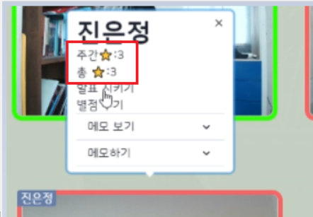

**5. 발표 시키기**

- 특정 학생을 지정해서 발표시킬 수 있습니다.


**6. 하이라이팅**

- 별점으로 평균을 내서 수업 집중도를 파악하고 붉은색, 초록색으로 나누어 하이라이팅을 제공합니다. 

  

**7. 학생 관리 - 학생로그 확인**

- 학생의 사진, 정보를 확인, 수정할 수 있고 별점과 메모 또한 확인 가능합니다.

  

**8. 랜덤 뽑기**

- 수업에 참여중인 학생들 중 랜덤으로 한 명을 뽑을 수 있습니다.

  

**9. 화면 공유**

- 수업에 사용할 화면이나 어플리케이션을 지정해서 공유 가능합니다.

  

**10. 메모**

- 학생에 대한 메모를 작성하거나 작성했던 메모를 확인할 수 있습니다.

  

**11. O/X**

- 학생들에게 즉석에서 O / X 문제를 만들어 출제할 수 있습니다.

  

  

**12. 다른 교실 입장**

- 열려있는 다른 교실에 입장 가능합니다.

  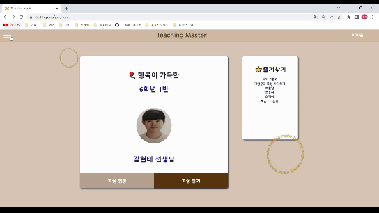

  

**13. 선생님 정보 수정 **

- 사진을 포함한  정보 수정이 가능합니다.

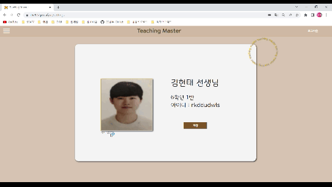


## 학생 제공 기술

**1. 별점 보기**

- 본인의 별점을 확인 가능합니다.

  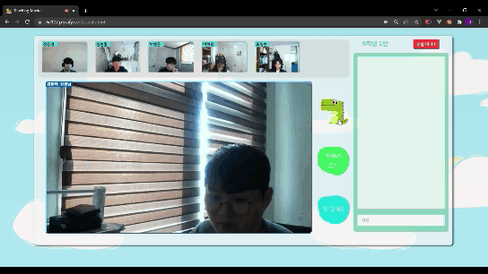


**2. 로그인 및 수업 입장**

- 학번과 이름으로 로그인하고 본인의 반에 입장 가능합니다

  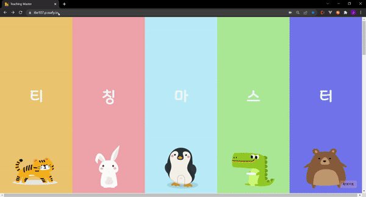


**3. 카메라/마이크 켜고 끄기**

- 카메라와 마이크를 자유롭게 on/off가 가능합니다

  


**4. 채팅**

- web socket을 이용한 채팅이 가능합니다.

  


# 4. 프로젝트 진행

---

## 1. Agile

짧은 기간과 온라인으로 진행된 프로젝트였기에 저희는 단기간에 최고 효율을 가져올 수 있게  `Agile` 방법으로 프로젝트를 진행하였습니다. 기획 단계에서의 시간을 절반으로 줄이고 문서기반의 개발보다는 실질적인 코딩을 하며 이용자가 만족할 수 있을 방향으로 개발 방향을 계속 바꿨습니다.

자주 일어나는 변경에 팀원들과의 소통이 가장 중요했습니다. 그래서 저희는 Jira를 사용한 스프린트 관리, 매일 아침마다의 회의를 통해 소통의 막힘이 없게 했습니다.


## 2. Git Flow

[우아한 형제들의 Git-flow 전략](https://techblog.woowahan.com/2553/) 을 참고하여 관리했습니다. 크게 `BACKEND` 와 `FRONTEND` 브랜치로 나누었고, 기능이 완성될 때 `BACKEND` 또는 `FRONTEND` 브랜치에 merge 했습니다. 하루의 작업이 끝나면 두 브랜치를 `develop` 브랜치에 merge했습니다. 또한, 한 주가 끝날 때 `develop` 브랜치를 `master` 브랜치로 merge했습니다.

`commit message`는 `.gitmessage` 파일을 만들어서 통일시켰습니다.

```
################
# <타입> : <제목> 의 형식으로 제목을 아래 공백줄에 작성
# 제목은 50자 이내 / 변경사항이 "무엇"인지 명확히 작성 / 끝에 마침표 금지
# 예) refactor - 가독성을 위해 서브 시스템 X를

# 바로 아래 공백은 지우지 마세요 (제목과 본문의 분리를 위함)

################
# 본문(구체적인 내용)을 아랫줄에 작성
# 여러 줄의 메시지를 작성할 땐 "-"로 구분 (한 줄은 72자 이내)

################
# feat : 새로운 기능 추가
# fix : 버그 수정 (수정, 삭제 포함)
# docs : 문서 수정
# test : 테스트 코드 추가
# refact : 코드 리팩토링 
# style : 코드 의미에 영향을 주지 않는 변경사항
# chore : 빌드 부분 혹은 패키지 매니저 수정사항
################
```

## 3. Jira

매주 월요일 오전 회의를 통해 금주에 진행할 이슈들을 백로그에 등록했습니다. 금주에 진행할 이슈 및 전주에 완료하지 못한 이슈들을 추가했습니다.

- 에픽은 메모, 퀴즈, 하이라이팅, 실시간 채팅, 상점 관리 기능, 웹사이트 제작, 화면으로 구성하였습니다.
- 스토리는 큰 단위로 나누어 `로그인` `퀴즈` 등으로 작성하였으며,
- 섭 테스크는 스토리의 세부적인 업무 단위로 나누어  `학생 퀴즈 결과값 전송` `학생 퀴즈 결과값 저장` `퀴즈 폴더 페이지 생성` 등으로 작성하였습니다.
- 에픽 링크 태그를 사용하여 이슈를 구별하기 쉽게 했습니다.
- 상황에 맞춰 지라를 관리하였고, 진행할 이슈들을 In Progress로 옮겨 각자 진행하는 부분을 팀원 및 담당자 모두가 확인할 수 있도록 했습니다.

## 4. Discord


모두가 공유해야할 자료 및 링크는 디스코드에 정리하여 불필요한 커뮤니케이션 리소스를 줄였습니다.

또한 음성채널에 항상 참여해 있는 상태로 작업을 하기로 약속했습니다. 갑자기 프로젝트의 변화가 생기더라도 원활한 소통을 할 수 있게 하였습니다.


중요한 정보나 다같이 참여해야 하는 링크는 `[이름]` 을 작성하고  `내용이나 링크` 를 추가하는 방식으로 정리를 하였습니다.

# 5. 배포

---

서버는 AWS EC2 ubuntu를 사용했습니다.

- 서비스 포트 번호 : 443

## **1. Docker**

- front 배포
  - front/dockerfile

      ```docker
      FROM node:16 as build-stage
      
      # 도커 컨테이너 내부 작업 디렉터리를 /app으로 지정
      WORKDIR /app
      
      # /front 내부 모든 파일을 {container}/app으로 이동
      ADD . .
      
      # 옮긴 파일들을 빌드
      RUN npm install
      RUN npm run build
      
      # Nginx =========================
      
      FROM nginx:stable-alpine as production-stage
      
      # front/nginx/nginx.conf 파일을 도커 컨테이너 내부로 이동
      # -> /etc/nginx/conf.d/default.conf로 이동
      COPY  ./nginx/nginx.conf /etc/nginx/conf.d/default.conf
      
      # /app 은 위에서 지정한 workdir 바로 아래 생긴 파일을 nginx로 웹 서버 구동.
      COPY --from=build-stage /app/build /usr/share/nginx/html
      CMD ["nginx", "-g", "daemon off;"]
      ```

  - front/nginx/nginx.conf

      ```docker
      server {
        listen 80;
        listen [::]:80;
      
          # server_name 도메인;
        server_name i6e107.p.ssafy.io;
      
        access_log /var/log/nginx/access.log;
        error_log /var/log/nginx/error.log;
      
        location / {
          alias /usr/share/nginx/html;
          try_files $uri $uri/ /index.html;
          return 301 https://$server_name$request_uri;
        }
      }
      
      server {
          listen 443 ssl;
          listen [::]:443 ssl;
      
          # server_name 도메인;
          server_name 서버도메인;
      
          ssl_certificate /var/www/html/fullchain.pem;
          ssl_certificate_key /var/www/html/privkey.pem;
      
          root /usr/share/nginx/html;
          index index.html;
      
          location / {
              try_files $uri $uri/ /index.html;
          }
      
          location /api {
              proxy_pass https://i6e107.p.ssafy.io:8080/api;
          }
      }
      ```

  - 도커 이미지화

      ```bash
      docker build -t [docker hub 계정]/[docker hub repo]:[버전태그]
      # docker build -t qkrtjddms27/frontend:1.0.0
      ```

  - 도커 실행

      ```bash
      docker run -d --rm -p 80:80 -p 443:443 -v /home/ubuntu/docker-volume/ssl:/var/www/html qkrtjddms27/frontend:0.2.7
      ```

- backend 배포
  - backend build (gradle)

      ```bash
      ./gradnotilew bootJar
      ```

  - backend/dockerfile

      ```docker
      # 자바 버전 사용
      FROM openjdk:8-jdk-alpine
      
      # build/libs/*.jar에 생성된 jar파일을 app.jar이름으로 도커 컨테이너 내부로 이동.
      ARG JAR_FILE=build/libs/*.jar
      COPY ${JAR_FILE} app.jar
      
      # 실행
      # properties 파일을 두 개 나눠서 관리하기 때문에 옵션 추가
      # --spring.config.name=application-prod
      # application-prod (배포용)
      # apllication (개발용)
      ENTRYPOINT ["java","-jar","/app.jar","--spring.config.name=application-prod"]
      ```

  - 도커 이미지화

      ```bash
      docker build -t [docker hub 계정]/[docker hub repo]:[버전태그]
      # docker build -t qkrtjddms27/backend:1.0.0
      ```


## 2. Spring ssl 적용

개발용 / 배포용 properties 따로 관리

- properties-prod (기존 개발용 +)
- properties에서는 주석처리해야되는 부분.

```xml
server.ssl.enabled=truewk
server.ssl.key-store-type=PKCS12
server.ssl.key-store=/root/key.p12
server.ssl.key-store-password=ssafy
```

## 3. 아키텍처 설계

### 시스템 구조

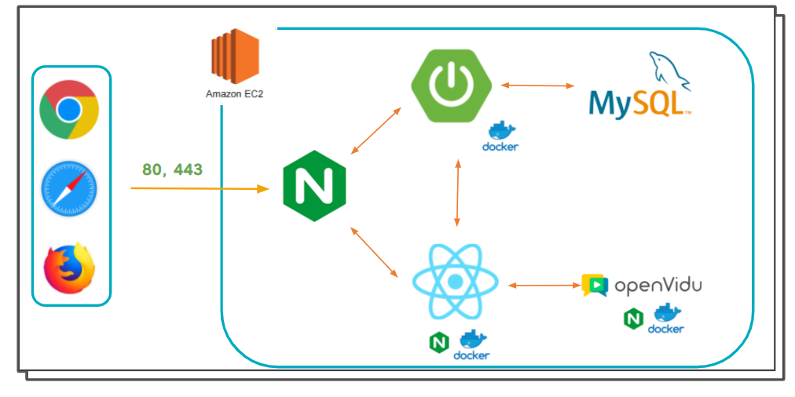

### DB 구조

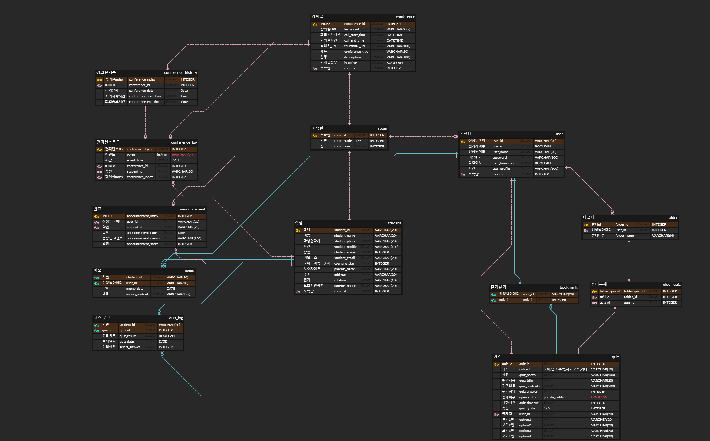


## 4. HTTPS

### HTTP란?

---

Client(Web Browser)와 Server간 자원을 주고 받을 때 쓰는 통신 규약

단점 : http는 단순 텍스트 교환으로 누군가 네트워크에서 신호를 가로채서 정보를 보는 것이 가능

### HTTPS란?

> HTTP의 보안 문제를 해결해주는 프로토콜
> 
---

Client(Web Browser)와 Server가 정보를 암호화하는 SSL(Secure Socket Layer)프로토콜을 이용하여 데이터를 주고 받는 통신 규약

- http text를 암호화하는 것
- 공개키 암호화 방식
- openvidu 사용을 위한 필수 스펙.

### Let’s Encrypt

---

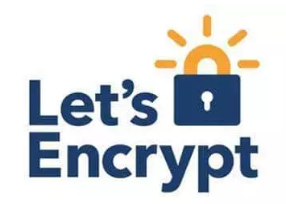

- HTTPS Everywhere을 위해 무료 SSL을 보급하는 비영리 프로젝트

**사용 이유**

- SSL 인증서 발급, 연장, 재발급 무료
- 콘솔에서 인증서 발급/갱신/설치/세팅 자동화 가능

### Certbot으로 SSL발급 과정

---

Let’s Encrypt SSL 인증서 발급을 위해 사용

1. certbot설치

```
$ sudo apt update
$ sudo apt-get install  letsencrypt -y
```

2. standalone방식으로 SSL 발급

```
$ sudo certbot certonly --standalone -d [도메인]
```

3. 인증서 이동 및 pem 변경

```
$ cd /etc/letsencrypt/live/[도메인]
$ openssl pkcs12 -export -in fullchain.pem -inkey privkey.pem -out key.p12 -name airpageserver -CAfile chain.pem -caname root
```

4. 인증서 복사

```
$ sudo cp fullchain.pem /home/ubuntu/docker-volume/ssl
$ sudo cp privkey.pem /home/ubuntu/docker-volume/ssl
$ sudo cp key.p12 /home/ubuntu/docker-volume/ssl
```


## 5. **Openvidu 설치**

1. root 권한으로 받아야함.

```
$sudo su
```


2. 작업 디렉터리로 이동 (docs 권장사항)

```
$cd /opt
```

3. openvidu 다운

```
curl https://s3-eu-west-1.amazonaws.com/aws.openvidu.io/install_openvidu_latest.sh | bash
```


4.  환경 파일 설정

```
# 환경설정을 위한 이동

$ cd openvidu
$ vi .env
```

5. .env 설정

```
DOMAIN_OR_PUBLIC_IP=(도메인)
OPENVIDU_SECRET=ssafy
CERTIFICATE_TYPE=letsencrypt
HTTPS_PORT=8443
```

6. 실행

```
$ ./openvidu start
```


# 6. UI/UX

## 1. wireframe

### 1) **선생님 페이지**

figma를 사용해 홈페이지의 초안을 작성합니다. 관련 레퍼런스를 참고하고, 서비스 특성에 맞게 제작했습니다.

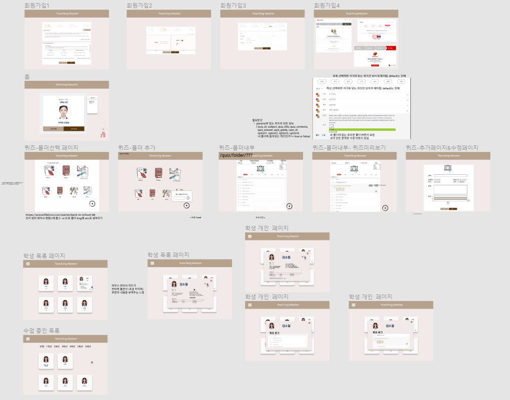

### **2) 수업 페이지**

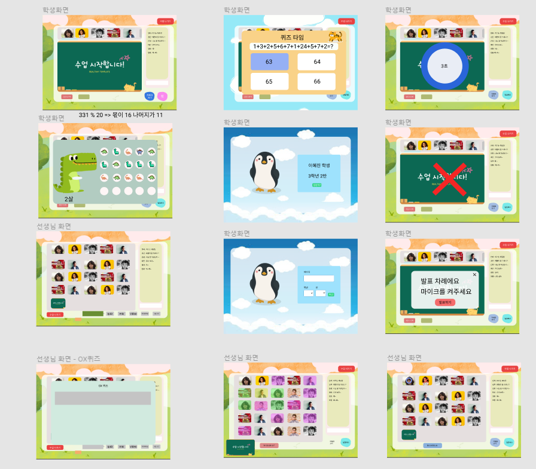

컴포넌트 단위로 디자인하였고, 선생님과 학생의 화면을 다르게 구성하였습니다. `수업`에 초점을 맞춰 웹 사이트에 맞는 모습으로 구성했습니다.


## 2. 디자인 소개

### 1) Main Page

- 저희의 서비스를 처음 들어오게 되면 대표 캐릭터들이 맞이해줍니다.
- 화면을 내리게 되면 각각의 캐릭터들이 티칭마스터의 기능들을 설명하는 방법을 통하여 새로운 유저가 유입이 되더라도 쉽게 저희의 서비스를 알 수 있도록 만들었습니다.


### 2) 퀴즈 폴더 페이지

- flaticon 의 아이콘을 이용해서 폴더 페이지를 구성했습니다.
- 매번 들어올 때마다 랜덤으로 모든 아이콘들이 달라지게 만들어 재미를 더했습니다.

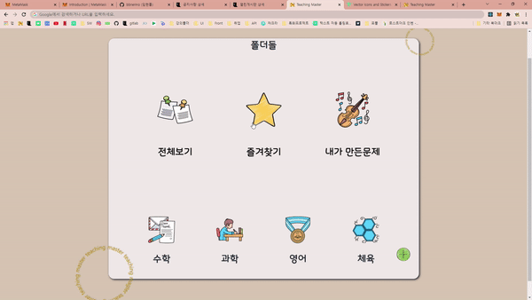


### 3) 여기저기 숨은 캐릭터들

- 티칭마스터 여기저기에 귀여운 캐릭터들을 배치해서 사용자들이 티칭마스터에 친근감을 느끼도록 했습니다.


### 4) 퀴즈 로그

- 학생들이 어떤 문제를 맞았고 틀렸는지 ⭕❌로 바로 알 수 있도록 했습니다.
- 퀴즈를 선택하면 학생이 어떤 답을 선택했고, 원래 정답은 무엇인지 알기 쉽도록 색깔로 구분지었습니다.

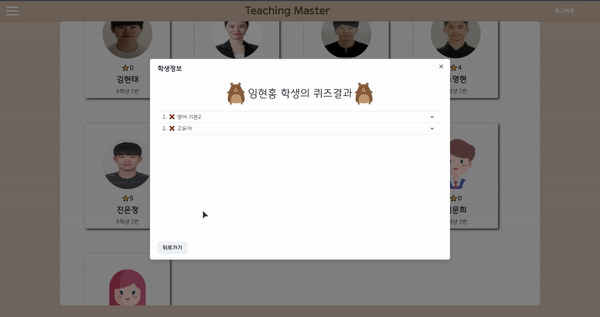

### 5) 학생 정보 확인

- 간단하게 학생 정보를 확인할 수 있도록 마우스를 학생 카드 위에 올렸을 때 필요 정보가 보이도록 하였습니다.

  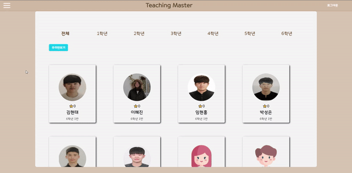


### 6) 말할래요, 쉿 버튼

- 어린 학생들도 사용하기 편하게 버튼 UI를 구성하였습니다.


# 7. 소감 및 배운점

## 소감

- 이혜진 : 처음엔 다 할 수 있을거라고 생각했지만 디테일한 부분까지 신경쓰다보니 포기하게 되는 기능들이 늘어간게 아쉽습니다. 처음으로 React를 사용한 프로젝트라서 많은 걱정을 안고 시작했지만 부딪히며 배우니 생각보다 빠르게 성장할 수 있었습니다. 팀원들도 서로 응원하고 도와가며 진행했기 때문에 무사히 마무리 지을 수 있었습니다.
- 김현태 : JPA, DSL Query같은 백엔드 기술뿐 아니라 Jira, Git, 배포 등을 제대로 해보면서 서투르지만 함께 많은 것을 배우고 이룩할 수 있었습니다. 아쉬운 점은 거의 모든 것이 처음 해보는 것이라 문제를 해결하고 즉각적으로 배우는 데 급급해서 발생한 문제, 문제를 해결한 방법 등을 기록하지 못한 것입니다. 팀원 모두 서로 양보하면서 프로젝트를 성공적으로 마무리했고 2달 동안 감사했습니다!
- 박성은 : 배포와 관련된 건 모두 처음이라 많이 낯설고 어려웠지만, 팀원들의 배려가 있어서 포기하지 않고 끝까지 노력할 수 있었습니다. 다른 팀원들이 항상 늦게까지 남아서 프로젝트를 하는 모습을 보며 동기부여를 얻어 프로젝트를 완주할 수 있었습니다. 아쉬운 것은 삽질한 기록을 제대로 남겨 두지 않아 프로젝트를 마무리하고 정리하는데 시간이 너무 많이 들었습니다.
- 임현홍 : 처음 사용해보는 React와 WebRTC를 선택해서 프로젝트 초반에는 정말 난항이었습니다. 하지만 리액트에 익숙해져갈수록 속도가 붙고 재미를 느끼며 프론트엔드라는 직무를 계속 하고 싶다는 확신이 생겼습니다.  이용자 입장에서 생각하고, 불편함을 예상하여 코드를 수정하는 과정이 가장 즐거운 시간이었습니다. 즐겁게 일하다 보니 팀원들과의 소통도 잘 되고 밝은 분위기에서  프로젝트 또한  만족스러운 결과로 마무리할 수 있었던 것 같습니다.
- 조영현 :  처음에는 크게 어려울 것이라 생각하지 못했지만 막상 부딪쳐보니 너무나도 생소하고 어려운 것들이 잔뜩이라 힘들었습니다. 자료를 찾으려해도 제대로 찾기 힘들고, 참고하려 해도 버전이 달라 적용되지 않는 부분들에 많이 지쳤지만 끊임없이 응원하고 격려하는 팀원들 덕분에 끝까지 노력할 수 있었습니다. 하지만 그 인고의 흔적을 제대로 기록으로 남기지 못했다는 것이 너무 아쉽습니다.
- 진은정 : 팀으로 진행하면서 깃과 지라 같은 협업 툴을 처음 사용하는 것에 대한 어려움이 있었는데 하나씩 규칙을 정하고 사용을 하면서 협업하는 방법에 대해 배울 수 있었습니다. 하지만 개발에 집중하다 보니 문제가 발생했던 부분들을 세세하게 기록하지 못한 점이 아쉬웠습니다. 프로젝트 진행 상황에서 어려운 부분이 많았는데 팀원들과 문제를 해결하기 위해 다 같이 의논하고 지식을 공유하면서 프로젝트를 완성할 수 있었습니다.

## 배운점

- 기록하자!
  - 6주간 삽집을 했지만 남은 문서가 없어 너무 아쉬웠습니다.
  - 회고 꼭 하자!
- 명확한 기획의 중요성
  - 프로젝트를 기획부터 설계, 개발, 배포하는 경험이 모두 처음이다 보니 확실하게 했음에도 개발하면서 적지 않은 수정을 거쳤습니다.
  - 설계를 시작하기전 기획을 명확하게 하는 것의 중요성을 느꼈습니다.
- **일신우일신(日新又日新)**
  - **매일 매일 배우고 익히고 나아간다는 말이다**. 프로젝트를 진행하면서 점점 많은 난관에 부딪히고, 새로운 오류에 힘들어했지만 지나고 보니 그 난관들은 우리를 발전시켰고, 그 오류들은 이제 어렵지 않게 느껴진다. 시간에 쫓기듯 작업했다 생각했지만 매일매일 나를 발전시키고 있는 것이었다. 앞으로 어떤 일을 하더라도 배우고 익히는 자세로 임하자.
